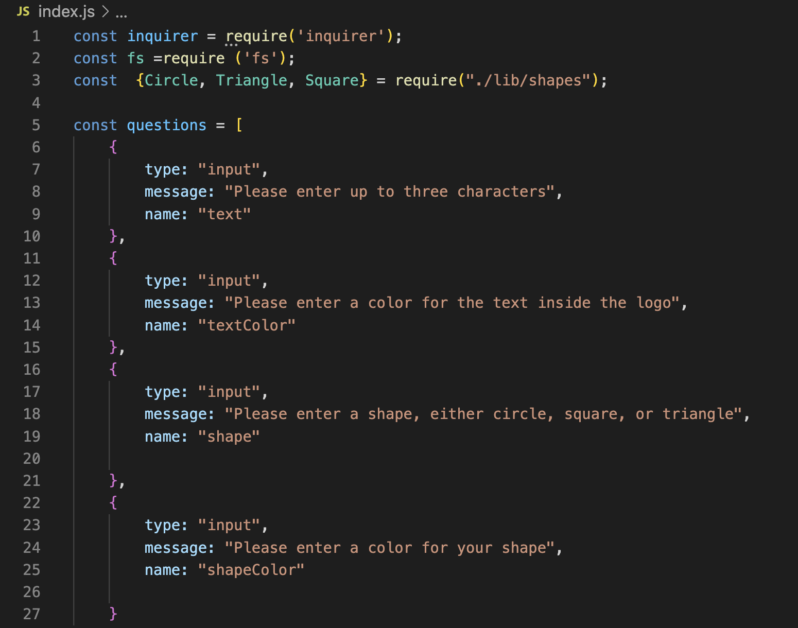
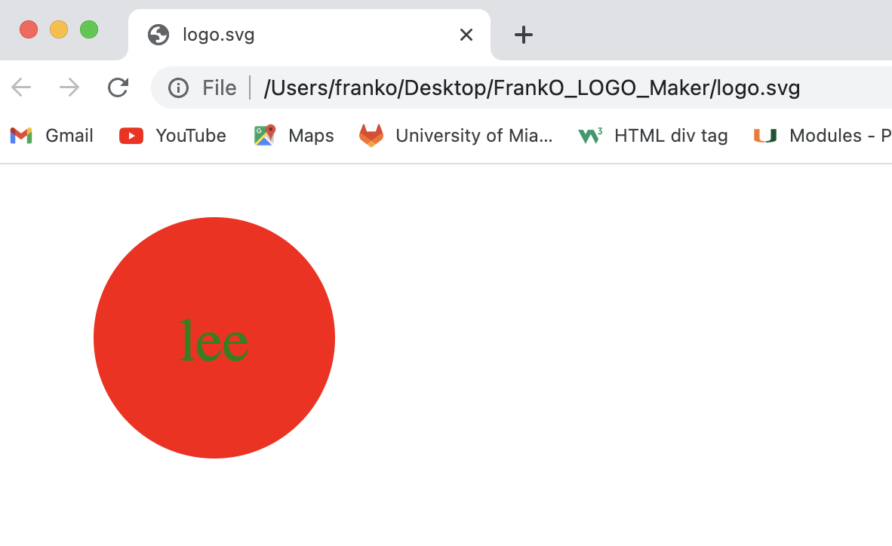

# FrankO_LOGO_Maker
going to make application that generates logos as svg files that is dependent on user input

As a freelance web developer, I am going to generate a simple logo maker or application for my projects so that I dont have to pay graphic designers anymore. This nodeJS program that runs in the command line and accepts user input when it is prompted for text. When it is prompted for a text color then then the user can enter a color keyword or a hexadecimal number. When prompted for a shape then the user will receive a list shapes to choose from: circle, triangle, and square. When prompted for a shapes color then  the user can enter a color keyword or a hexadeciaml number. When the user enters input for all the prompts,  then a svg file will be created named 'logo.svg' and the output text will be generated back on the command line. Finally when the user opens the logo.svg file in a browser then a 300x200 pixel image that matches the criteria the user entered.

Sreenshot of application: 

Screenshot of logo file generated:
